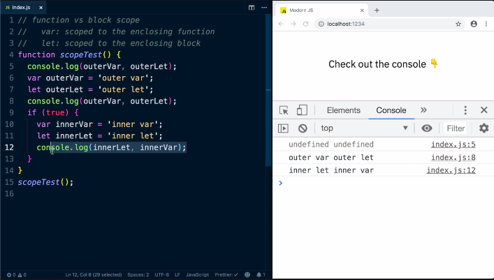
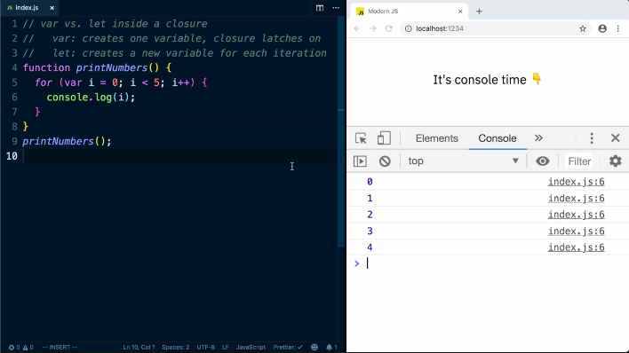
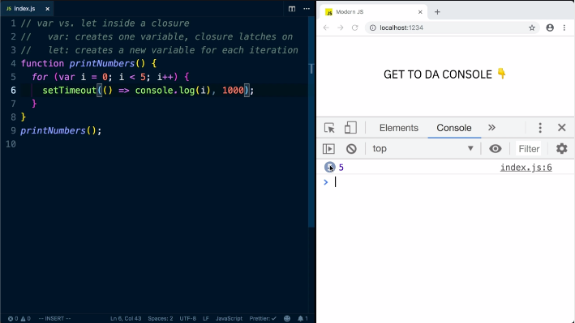
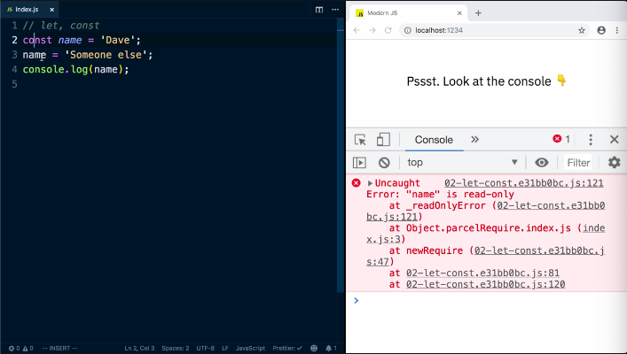
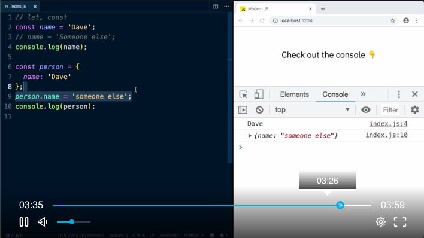

`let` and `const` differ to `var` by the fact that they are scoped to the inclosing block instead of to the inclosing function. 

```js
function scopeTest() {
	var outerVar = 'outer var';
	let outerLet = 'outer let';
	if (true) {
		var innerVar = 'inner var';
		var innerLet = 'inner let';
	}
}
scopeTest();
```



A common gotcha for `var`'s use case in a `for` loop. 



This works fine but if we have to add in a timeout, it messes with everything. 



But if we replace `var` with `let`, it works just fine. 

Now we are going to look at `const`. 

Simply put, const = constant. You can't really change the value once it is set.



But if we assign an object to `const`, we can change the contents of whats inside of that object. 



The same is true for arrays. 
