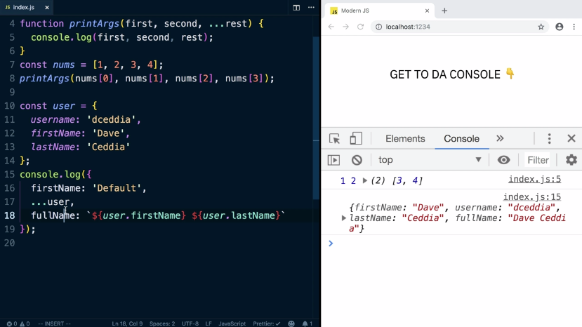
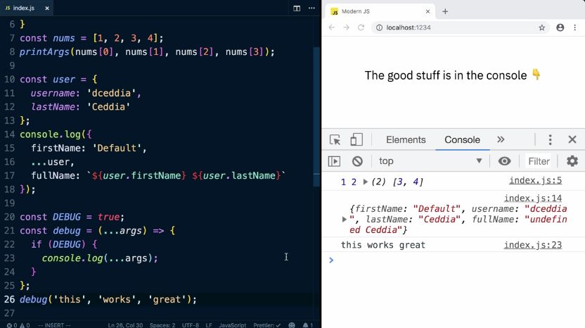

When you're writing out a function, you can use ES6 rest arguments, which are the three dots before a parameter, to collect all the arguments together into an array. Calling the function with a set of arguments like one, two, and three will return an array of one, two, and three.

```js
function printArgs(...args) {
  console.log(args)
}
printArgs(1, 2, 3); // (3) [1, 2, 3]
```

The rest arguments parameter needs to be the last one, but you can put parameters before it. We can have first and second and then the rest.

If we print out our first and our second and the rest, you can see printed the first and the second, combining the rest of them into an array.

```js
function printArgs(first, second, ...rest) {
  console.log(first, second, rest);
}
printArgs(1, 2, 3, 4, 5); // 1 2 ▶ (3) [3, 4, 5]
```

If you don't have enough arguments, it'll just be an empty array. Including if we call it with nothing, we can see first and second were undefined, but rest is still an empty array.

```js
// undefined undefined ▶ []
```

The spread operator looks the same except it explodes an array in place. You could spread out the numbers and then it's going to pass them in as individual arguments to the function. 

```js
function printArgs(first, second, ...rest) {
  console.log(first, second, rest);
}
const nums = [1, 2, 3, 4]
printArgs(...nus); // 1 2 ▶ (2) [3, 4]
```

The spread operator works on objects too. If we logged out an object with ...user, this explodes all the properties into this brand-new object. This is useful if you want to add properties to an object without modifying the original.

It's important to know that the order matters too. If we had a first name before our user -- say the first name was default and then user and full name -- the properties from the user will override existing ones in this object.



A nice way to combine the rest and spread operators is if you need to write a debug function that will print or not print something based on some global flag.

We'll write a function called debug that takes in some arguments. This forwards them along to console a log but only if debug is true.



If false, it doesn't print out anything. 

