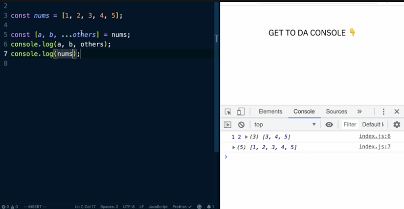

An easy way to pull values out of an array is using ES6 destructuring. 

```js
const nums = [1 ,2 3, 4, 5]

const [a, b] = nums; 
```

This will create a variable called A that has a value 1 and a variable called B which has the value 2, and then the rest of the array elements will be ignored. 

You can also combine the rest operator with destructuring to put the remaining items into a new array. This one will be called Others. Then we can log out our A, B, and Others.

```js
const nums = [1 ,2 3, 4, 5]

const [a, b, ...others] = nums;
console.log(a, b, others); // 1 2 ▶ (3) [3, 4, 5]
```

Just like using the rest operator with functions, if we don't have enough items in our arra it is going to be an array even if it's empty.

Also notice that I printed out nums. It hasn't been changed by this destructuring operation. 



We can destructure objects as well. If we have an object called User with these fields here, we can pull out the username and first name field and store them in variables and log them out here.

By using the curly braces on the left side of the equal sign, we're saying that we expect this thing to be an object. Pull out the username key and put it in a variable called username and the first name key and put it in a variable called First Name.


The variable names here need match key names in the object. You can rename them if you need to by putting a colon and the new name. 

We can specify default values for these keys. If they're missing and we had a full name key, we could say its default is 'MISSING'. If we log that out, we'll see we get the value missing. If the object has a full name then the full name will get that value instead.

Just like with arrays, we can use the rest operator. Just like array destructuring, it doesn't modify the original user. 

If you have an object like this that has a nested array, and this array has objects inside it, you can pull these values out with destructuring as well by using nested destructuring.

```js
const user = {
  username: 'dcedia',
  firstName: 'Dave',
  lastName: 'Ceddia',
  posts: [
    {id: 1, title: 'Best Post Ever' },
    {id: 2, title: 'Second Post Ever' }
  ]
};

const { posts: [{ title }, { title: t2}]} = user;
```

What we don't have is the Posts. 


When you're destructuring multiple levels, only the deepest keys become variables. If you also needed the whole array of Posts, you'd need to pull that out separately.

Multilevel structuring is unadvised as it can be pretty messy. 

If you've used React, this is one place where you're going to see destructuring used a lot in the real world. If you're writing a function component, and it takes props, the props object is usually written destructured.

Hooks use destructuring too. The useState hook might take the initialCount and use useState is going to return an array with two items in it. 

```js
function Counter({ initialCount }) {
  const [useState(initialCount) 
}
```