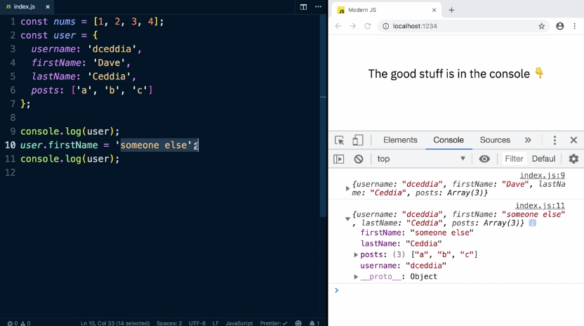
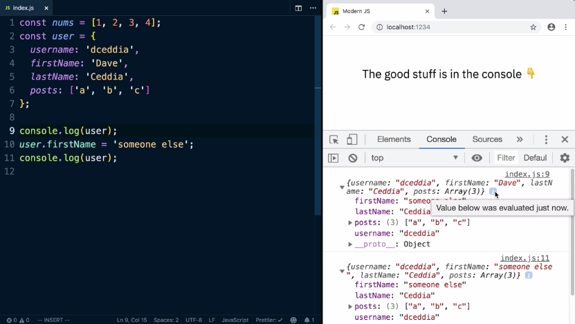
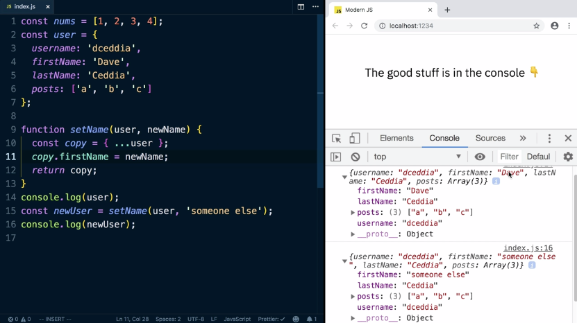
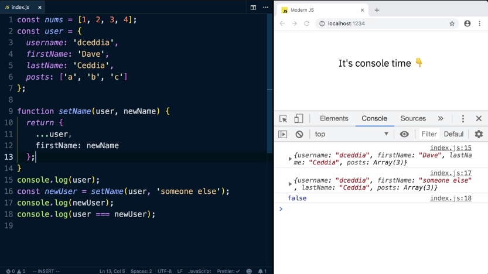

Mutate is just a fancy word for change. If we log out the user and then change the user's first name, and then log out the user again, we've mutated the user.

If we expand the items in the console over here, you can see that the second one says the first name is someone else. 



In the developer console, when you console log out an object, it actually keeps it referenced to the object itself.

If we mouse-over this little "i" here, we can see it says value below was evaluated just now. 



Another kind of common mutable code is a function that takes an object and changes it. If we had a set name that took a user and a new name, and then set the user's first name to the new name, we could log out the user and call set name on that user with a new value, and then log out the user again.

We'll see the same as we did before. The first time it says it's Dave and the second time it's someone else. 

This happens because JavaScript passes variables by reference. When we pass the user in here, we're not passing in a copy of the user, we're passing in a reference to the user object. When we change it in a function that change cascades out to the actual object.

Sometimes you'll see code like this that changes the user and then returns it. To call it, you might put the value into a new user and then log out that new user.

```js
function setName(user, newName) {
  user.firstName = newName;
  return user;
}
console.log(user);
const newUser = setName(user, 'someone else');
console.log(newUser
```

The trouble is we are still modifying the user that's passed in, even though we're returning one. All this might look like it won't change the user, it actually will. 

The way to update the user immutably is to make a copy of the user object. An easy way to do that is to create a variable and use the ES6 spread operator to spread out the user inside a new object. We can change the first name in the copy to be the new name then return that copy. Now if we try this, at the top level, we see it works the same way.



If we expand these objects, we can see that we left the original user untouched. 

Testing to see if they are the same thing by setting `user === newUser`, we see that it's false. Which makes sense because we created a brand new object and returned that new object.

Another way to write this update would be to do this first name assignment inside the new object. We spread out the user and then set the first name to a new value. This will override the first name from the user here. Now we can just return the copy. We could simply this one step further by returning the object itself without saving it into a variable.



Notice how the user has this nested array of posts inside. When we explode the user in place here, we're copying over these four keys and then overriding the first name.

This is effectively the same as saying posts is user.posts, username is user.username, and so on. That means that the array of posts inside this new object will actually not be a copy of this array, it will actually be a reference to the original.

We can prove that if we console.log out `user.posts === newUser.posts`. We can see that's true. They both have the same array of posts.

To do a nested update where you change the name and the posts, set posts to a new array. 

```js
function setName(user, newName) {
  return {
    ...user,
    firstName: newName,
    posts: [...user.posts, 'd']
  };
}
```

Now when we check if the posts are equal, we see false.