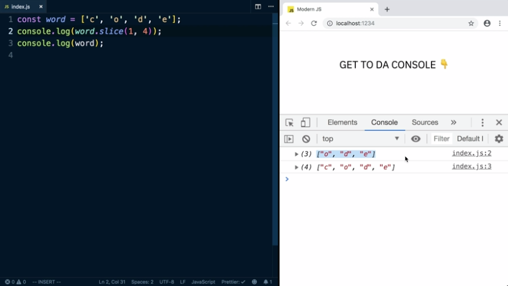

To remove an item from an array, we can use the slice function by calling word.slice.

Slice takes two arguments, the beginning and the end, but it doesn't include the end index. We're going to use 1 to start because this is index 1 and we'll use 4 to end because that's 1 past the end here. If I log out the word, we're going to see the word hasn't changed at all. If I log out the sliced value, we can see it return the last three letters.

The easier way to do this, if you just want to remove the first item, is to just leave the second argument off. Doing this will get you the same result. 

To remove all but the last item, we would just slice out `(0, 3)`. Instead of a hard coded number for our second argument, we could use `word.length - 1`.

If we wanted just the last item, we can pass a negative number to slice, starting from the right instead of the left. If we go -1 we'll start with E. If we go -2, it'll start with D and take the rest. -3 will start with O and take the rest. -4 will start at the beginning. If we pass -5 or any other number that's larger than the size of the array, it will just get the whole array.

To remove items from the middle of the array, you would use slice instead. slice can add or remove items from an array. 

The first argument to splice is going to be the index where we want to start making our changes. Let's say we wanted to remove the letter O, that's index 1. If I leave the second argument blank, it will remove the rest of the word. 

You can see the call to splice returned the letters that were removed and modified the word to just have the first letter.

The second argument to splice is how many items to remove starting at index 1. If we wanted to just remove the O, we could pass a 1.

To add an item, you pass any more arguments after your first two and it will insert them at that position after doing the removing. Let's remove O and D and add in  X and Y.

Since splice modifies the original array and the value it returns is the stuff that removed, if you want to do an immutable update, you'll need to make a copy first and store that copy in a variable. We could make a new array and spread our word into it and then do our modification to the copy and log out the copy.

