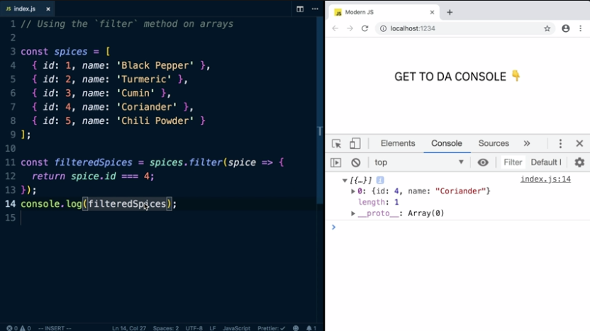

To remove some items from a function, we can use the keyword filter. If the function returns a truthy value, it will keep the item. If it returns a falsey value, it will discard it. 

Notice this will not change our original array. 

Rather than mutating the array you call it on, filter is going to return a brand-new array. We could try some other things here like saying we want the spice IDs that aren't 4. This will give us everything but coriander. Now we've got four spices here.

You can also filter by everything that isn't a certain thing, such as an ID of 4, and it will return everything that isn't that id, basically just excluding the items with an ID of 4. 

This is great whenever you want to create a new array that has fewer items than the one you started with.