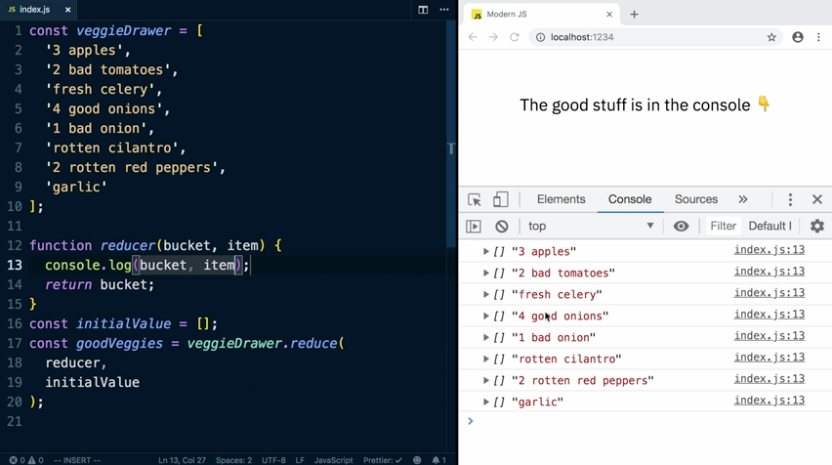

The reduce function on arrays is the most general purpose of all of them. It can stand in for filter and map and it can do even more than that. 

Unlike filter and map that always return arrays, reduce can return anything. The initial value is usually going to be of the same form as your result. Let's reduce this VeggieDrawer full of good and bad vegetables into a final array that has just the good ones.

```js
const veggieDrawer = [
  '3 apples',
  '2 bad tomatoes',
  'fresh celery',
  '4 good onions',
  '1 bad onion',
  'rotten cilantro',
  '2 rotten red peppers',
  'garlic'
];
```

Start by writing the reducer function. It takes two arguments. The first is the previous value. I'm going to call it bucket. The second argument is the item in the array. The reducer is going to get called with each item in this array. Whatever you return from this reducer becomes the value of bucket for the next time around.

```js
function reducer(bucket, item) {

}
```

It's a way of saving a value in between each call. In this case, we're building up this array. 

Let's put a console log in here of the bucket and the item and run this code and see what happens. 



You can see it gets called once for each item in the array. Since we're returning the empty bucket every time, we get that all the way through. In the end, our log out result with GoodVeggies and it's empty.

To make this work, we're going to inspect each item. If the item includes the text bad or rotten, then we don't want to keep that one. We're just going to return the bucket as it is.

Otherwise, this vegetable must be good so we're going to say bucket.push item and then return this new bucket with the extra vegetable in it. 

```js
function reducer(bucket, item, index, array) {
  console.log(bucket, item);
  if (
    item.includes('bad') ||
    item.includes('rotten')
  ) {
    return bucket;
  }

  bucket.push(item);
  return bucket;
}
```

This now will save all of our good vegetables and exclude all of our bad ones. 

Yes, we could just write this with filter, so let's try returning a more complex value, such as an object.

We'll also keep a count of how many good vegetables there are by adding all of the numbers associated with each vegetable. We should end up with 9 good vegetables.

We can keep the if block. If it's good, we need to put the item into this veggies array, which is bucket.veggies. We're also going to increment bucket.howMany by however many vegetables are in this bunch.

To do that, we're going to use parseInt on the item. The way parseInt works, is it will change a string of a number into a numeric value. ParseInt will stop at the first non-numeric character. If we say 7 apples, we're still going to get 7.

If we try to parse a string that isnt a number, we'll get NaN. What we'll do is store this number in a variable called parseInt(item). We use the built-in isNaN function to check if count is a number or not. If it's NaN, then we'll just count this as 1. Otherwise, we'll use the full count. This will return us our array of 4 vegetables with a total of 9 good ones. 

```js
function reducer(bucket, item, index, array) {
  console.log(bucket, item);
  if (
    item.includes('bad') ||
    item.includes('rotten')
  ) {
    return bucket;
  }

  const count = parseInt(item);
  bucket.veggies.push(item);
  bucket.howMany += isNaN(count) ? 1 : count;
  return bucket;
}
```

If we were to return a different value for the last item, then our result could be a different shape than our intermediate accumulator.

To do that, we can take two more arguments, the index of the item and the array itself. Then we can check the index against the length of this array and return a different value based on that.

```js
function reducer(bucket, item, index, array) {
  console.log(bucket, item);
  if (
    item.includes('bad') ||
    item.includes('rotten')
  ) {
    return bucket;
  }

  const count = parseInt(item);
  bucket.veggies.push(item);
  bucket.howMany += isNaN(count) ? 1 : count;

  // You have 9 veggies: a, b, c
  if (index === array.length - 1) {
    return `You have ${
      bucket.howMany
    } veggies: ${bucket.veggies.join(', ')}`;
  }

  return bucket;
}
```

Now if we try running this, you can see that all the intermediate calls were the same as before, where we have our object and the item. The final result is a string that summarizes all the good vegetables in the drawer.