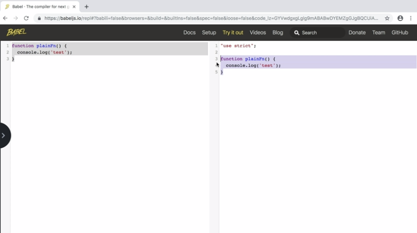
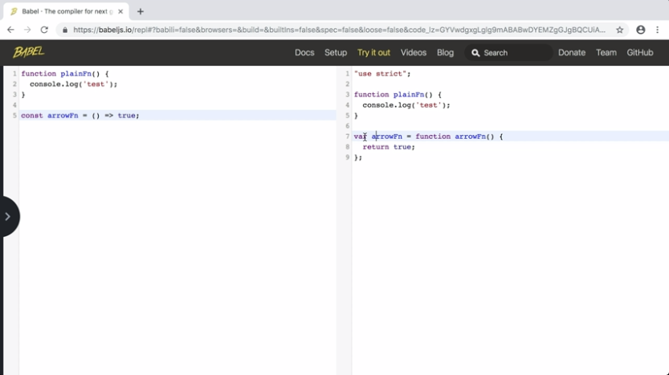
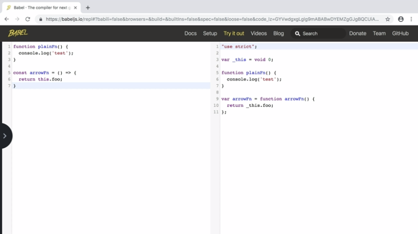
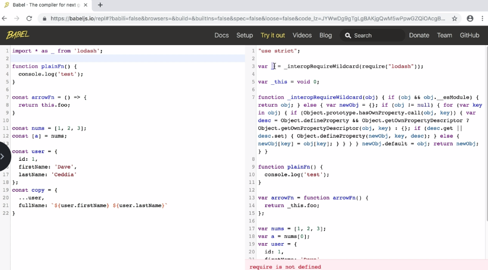
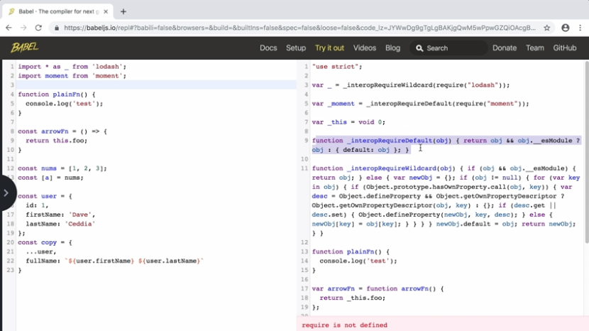

Some of the modern syntax from ES6 and beyond isn't supported by modern browsers yet. In most JavaScript apps, we'll go through a compile step where a bundler like Webpack or Rollup or Parcel passes it through the Babel compiler and produces JavaScript. Let's take a look at how Babel handles some of these constructs.

We'll put in code on the left, and you'll see the compiled version on the right. Here's just a regular function. You'll see it adds use strict at the top, but this plain function, it just leaves along, because this is regular JavaScript syntax.

If we paste in an arrow function, you can see Babel turns that into a regular function using var instead of const. 

If we try to access `this` from inside the arrow function, Babel's going to store a reference to the surrounding this in a variable and then use that in your function.

Now let's try creating an array of numbers. You can see it puts it in a var. If we then destructure the first value from that array, you can see how Babel just accesses the array at index0 and puts that value into a variable called a.

If we create an object and then make a copy of that object using the spread operator, Babel changes the const to var, but it leaves the spread operator alone. If we add a key that uses template strings, you can see how it converts the template strings into a series of concatenations starting with empty string, concatenating first name and a space, and then concatenating last name.

Let's try adding an import at the top of the file. This line here corresponds to the import itself, where it's using require with a library and storing that in a variable called underscore, but you can also see how it inserted this entire function to do the require itself.

Down below, you can see require is not defined. That's because require is defined by your bundler, whether that's Webpack or Parcel or whatever. We'll try adding a default import too. You can see the import here and how Babel's added another function to do the default import.

We could also do something like only keep the spices that start with C by doing `spice.name.startsWith('C')`. Now, we only have the three spices that start with C.

Filter is a great choice whenever you want to create a new array that has fewer items than the one you started with.